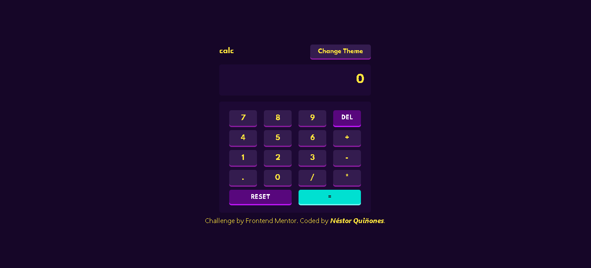
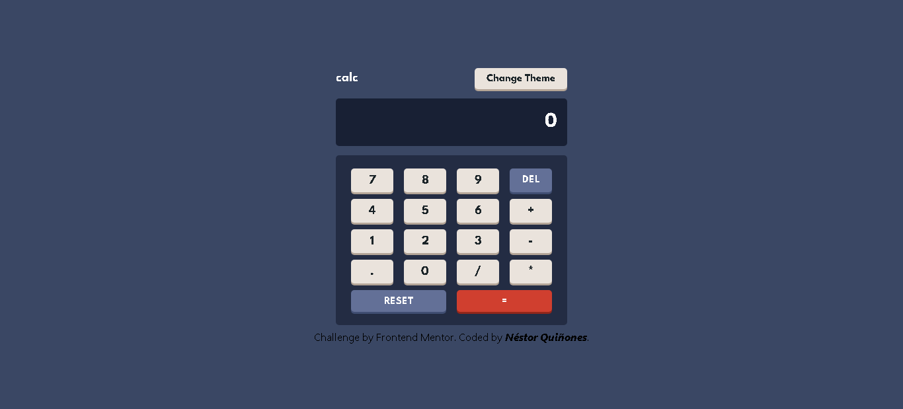
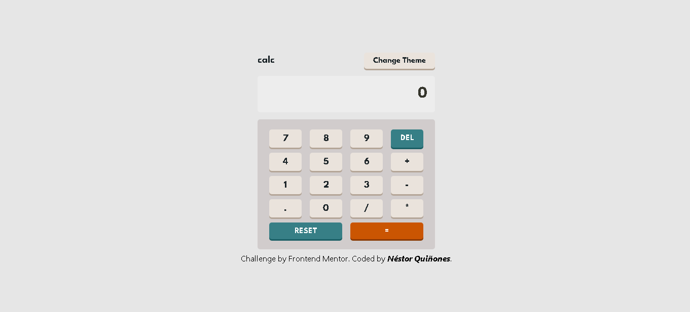
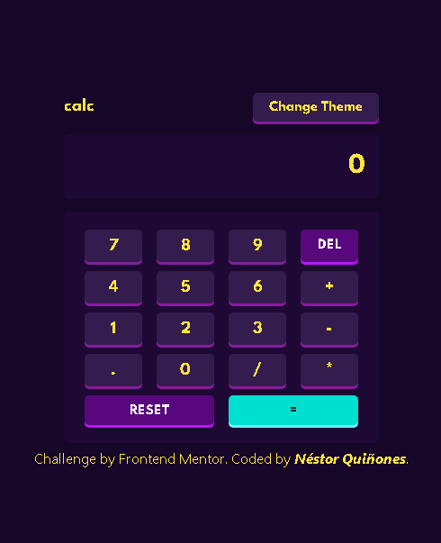
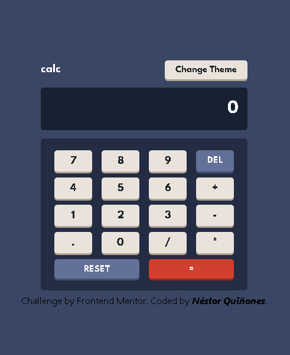
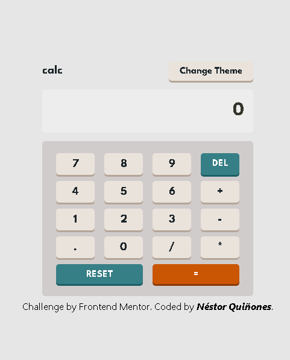

# Frontend Mentor - Calculator App.

This is a solution to the [Advice generator app challenge on Frontend Mentor](https://www.frontendmentor.io/challenges/advice-generator-app-QdUG-13db). Frontend Mentor challenges help you improve your coding skills by building realistic projects.

### The challenge

Users should be able to:

- View the optimal layout for the app depending on their device's screen size.
- See hover states for all interactive elements on the page.
- Generate an application of a functional calculator that solves basic arithmetic operations.
- Being able to switch between the three themes that the application provides, which are Dark, Light and Cyan.

### Screenshot
## Desktop view:

-Cyan Theme:

-Dark Theme:

-Light Theme:

## Mobile view:

-Cyan Theme:

-Dark Theme:

-Light Theme:

### Links

- Solution URL: (https://github.com/nestordqa/calculator)
- Live Site URL: ()

## My process

### Built with

- [Next.js](https://nextjs.org/) - React framework
- [React](https://reactjs.org/) - JS library
- Typescript
- Big-js - ReactJS Library for arithmetic operations.
- Tailwind CSS
- CSS Modules

### Continued development

I will keep developing on NextJS, Tailwind and Typescript. I think, they are greatest tools than a fullstack developer can use today.

### Useful resources

- [Tailwind Docs](https://tailwindcss.com/docs/) - This helped me for all styles, awesome tool.
- [NextJS Docs](https://nextjs.org/docs/deployment) - This is an amazing article which helped me finally understand workflow of NextJS with typescript.

## Author

- Website - [Nestor Quiñones](https://github.com/nestordqa)
- Frontend Mentor - [@nestordqa](https://www.frontendmentor.io/profile/nestordqa)
- Instagram - [@ynestordqa]()

